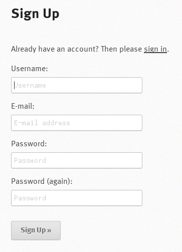
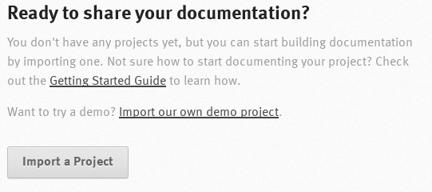
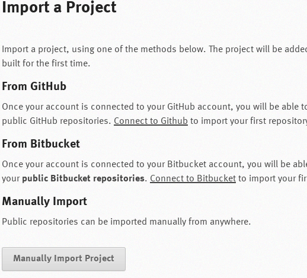
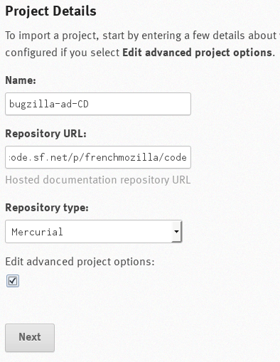
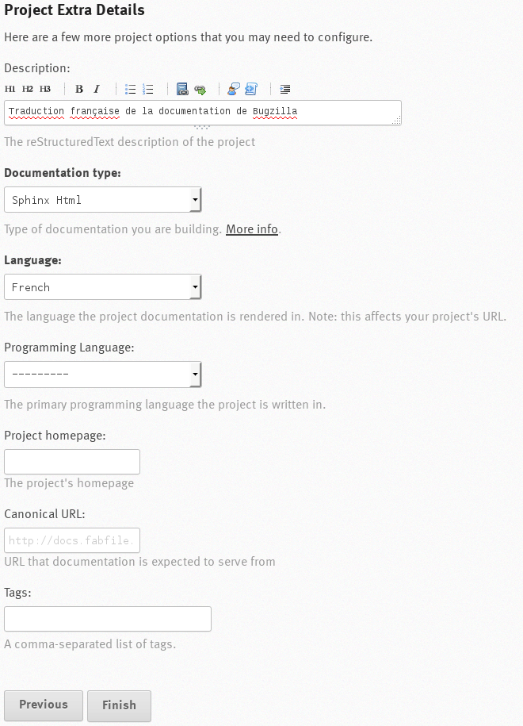
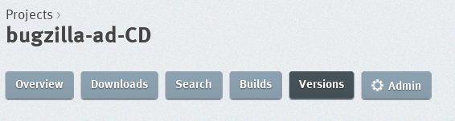
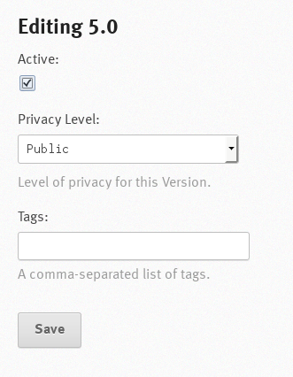
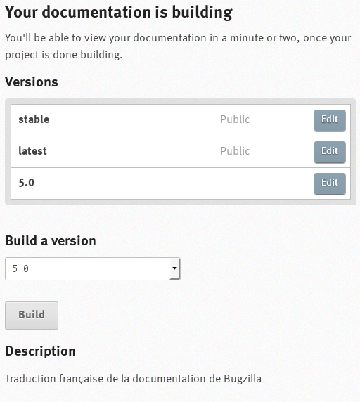
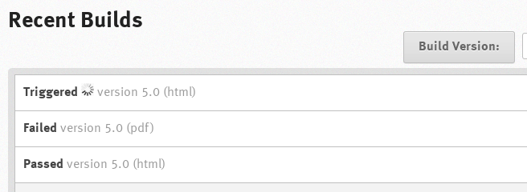

.. _hosting-documentation:

Hosting The Documentation On readthedocs.org
############################################

You will want to make your templates and documentation available in a
localization tarball for sites to install. However, Bugzilla's main
documentation site is readthedocs.org. If you put your localized documentation
up on that site, then it can be linked in with the main Bugzilla docs and
appear as an alternative version.

To do this, you need to have a
`DVCS <https://en.wikipedia.org/wiki/Distributed_revision_control>`_ repository
of your files accessible from the Internet. ReadTheDocs.org currently supports
Mercurial, Git, Subversion and Bazaar repositories, but if you are working in
a clone of the main Bugzilla repo, you will be using Git.
You can create your repository on sites such as
`Github <https://github.com/>`_ or `sourceforge.net <https://sourceforge.net/>`_.
It is both easiest and best if you publish your entire code tree, including the
Bugzilla source code, as some of it is needed to compile the docs.

You should localize on the branch or head named after the major number of the
release, for instance '``5.0``'. If you are making your own repo rather than
cloning the Bugzilla one, you should name your branches in this way also.

Then, get on the `readthedocs.org <https://readthedocs.org>`_ site and create
an account by clicking on the button :guilabel:`Sign up`. Fill up the form and
click on the :guilabel:`Sign Up »` button:

*Sign Up Form*

On the page that appears, click on the :guilabel:`Import a Project` button:

*Ready to share your documentation*

Then, either connect to your GitHub account or click on the :guilabel:`Manually Import Project`
button. The manual way will be explained below.

*Import a Project*

You should now name your project, following the naming rule ``bugzilla-ab-CD`` --where ab-CD is your locale code--,
specify the URL for your repository and its type, and tick the :guilabel:`Edit advanced project options:` square. Click then
on the :guilabel:`Next` button:

*Project Details*

Fill now the new form, especially the :guilabel:`Description`, :guilabel:`Documentation` and :guilabel:`Language` fields. The other
fields can be ignored and modified later if necessary. Then, click on the :guilabel:`Finish` button:

*Project Extra Details*

Now, click on the :guilabel:`Versions` button in the navigation header and in the :guilabel:`Inactive Versions` section, choose
the version you want to activate by clicking on the :guilabel:`Edit` button:

*Versions*

.. image:: ../../images/RTD7.png

*Inactive versions*

Tick the :guilabel:`Active:` square and click on the :guilabel:`Save` button:

*Editing Version*

Now, click on the :guilabel:`Overview` button in the navigation header. The version you have just made active should appear there.
In the :guilabel:`Build a version` dropdown list, select the version you want to compile and click on the :guilabel:`Build` button to compile
your localized documentation:

*Overview*

*Compilation Results*

If the result is ``Passed``, your documentation has been successfully compiled. If the result is ``Failed``, click
on the link to see what went wrong and fix it.

Finally, you should inform the Bugzilla Project that the documentation is ready in your language by sending a mail to
the mailing-list ``developers AT bugzilla.org`` giving your project name, that is ``bugzilla-ab-CD``. They can
then link your docs into the main Bugzilla docs so that they show up as an alternative language.
